# Attember

> **참석하고, 기억하고, 다음 행동까지 이어 주는 로컬 우선 macOS AI 업무 허브**

**AI Agent:24 Hackathon Submission** · Native macOS · Local-first · Human-in-the-loop

[](https://github.com/Dindb-dong/Attember_Release/releases/download/v1.0.5/Attember-1.0.5-macOS-arm64.dmg)

Attember는 Mail, Calendar, KakaoTalk, Telegram 등 여러 곳에 흩어진 메시지와 일정을 한곳에서 정리하고, 실행할 일을 찾아 Task로 연결하며, 필요할 때 Codex와 함께 실제 로컬 작업까지 수행하는 네이티브 macOS 앱입니다.

단순히 답변을 생성하는 AI가 아니라 **수집 → 맥락화 → 판단 → 실행 → 확인**의 전체 흐름을 사용자의 Mac 안에서 이어 주는 개인 업무 에이전트를 목표로 합니다.

## 왜 Attember인가요?

우리가 놓치는 일은 정보가 없어서가 아니라, 정보가 너무 많은 곳에 흩어져 있기 때문에 생깁니다.

- 메신저에서 약속한 일을 다시 할 일 앱에 옮겨야 합니다.
- 일정, 메일, 대화와 프로젝트 맥락이 서로 분리되어 있습니다.
- AI가 만든 답변은 실제 실행이나 후속 관리로 자연스럽게 이어지지 않습니다.
- 강력한 자동화일수록 개인정보, 권한과 복구 가능성이 불투명해집니다.

Attember는 사용자가 선택한 데이터만 로컬에 모으고, 근거와 출처를 보존한 채 실행 가능한 Task로 바꿉니다. 자동화와 에이전트 동작은 상태를 드러내며, 중요한 작업은 사용자의 확인 아래 진행됩니다.

## 핵심 경험

### 오늘 해야 할 일에 집중

- **Home**에서 오늘 일정, 마감, 기한 초과와 중요 업무를 한눈에 확인합니다.
- 긴급도와 중요도를 함께 보는 Task Map으로 우선순위를 정리합니다.
- **Tasks**에서 일정, 중요도, 출처와 메모를 관리하고 `알아서 하기`로 로컬 작업 실행을 요청할 수 있습니다.

### 메시지와 일정에서 실행 항목 발견

- **Inbox**에서 연결된 대화를 모아 보고, 필요한 메시지를 Task로 전환합니다.
- **Search**에서 메시지, Task, 메모와 저장된 맥락을 통합 검색합니다.
- Apple Mail, Calendar, Telegram, Slack, Discord와 실험적 KakaoTalk 로컬 연동을 지원합니다.

### 대화에서 실제 작업까지

- **Chat**은 대화 기록과 로컬 맥락을 유지하며 Attember 도구를 호출합니다.
- Codex 런타임을 통해 Task에 맞는 workspace를 찾고, 격리된 Git worktree에서 작업을 실행할 수 있습니다.
- 실행 상태, 변경 파일, 검증 결과와 원시 이벤트를 확인할 수 있습니다.

### 근거를 남기는 자동 리서치

- **Auto Research**가 사용자 프로필에 맞는 공모전, 해커톤과 기회를 조사합니다.
- 공식 공고와 복수 출처를 재검증하고, 추천 이유와 근거 URL을 함께 보존합니다.
- 발견한 기회를 바로 Task로 연결할 수 있습니다.

### 로컬 운영을 투명하게

- **Health**와 **System**에서 커넥터, 백그라운드 Agent, Codex 런타임, 메모리와 저장 공간 상태를 확인합니다.
- **Dev CleanUp**에서 Git 저장소, worktree, 관련 프로세스와 Docker 자원을 진단하고 정리 대상을 검토합니다.
- 자격 증명은 macOS Keychain에 저장하고, 앱 데이터는 Mac의 로컬 SQLite에 보관합니다.

## 제품 화면

| Home | Tasks |
|---|---|
| 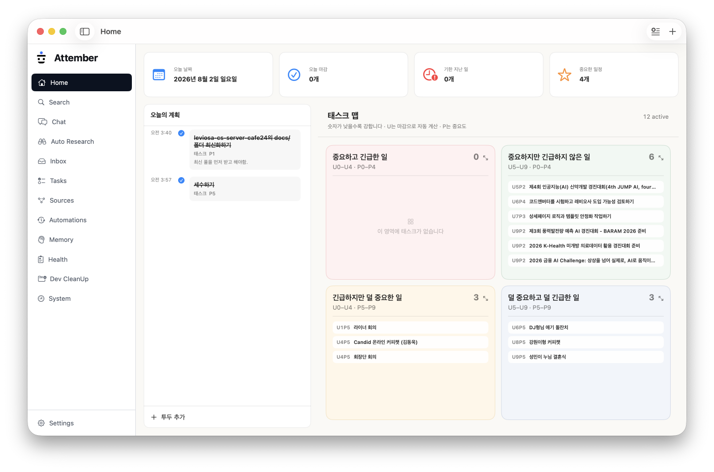 | 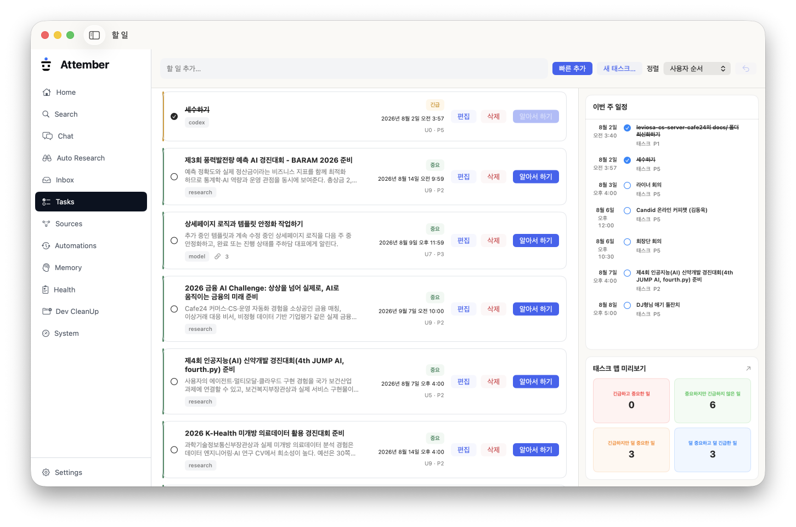 |

| Inbox | Chat |
|---|---|
| 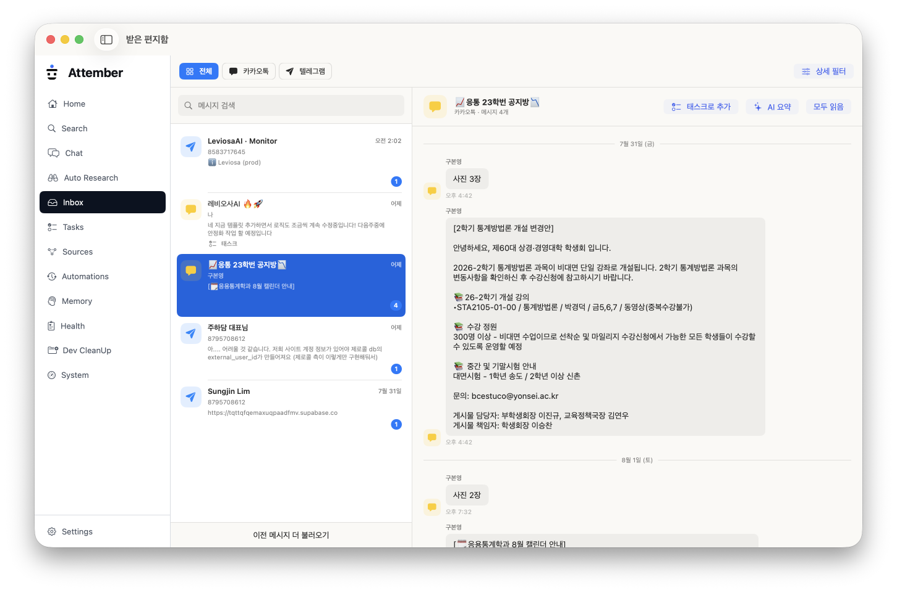 | 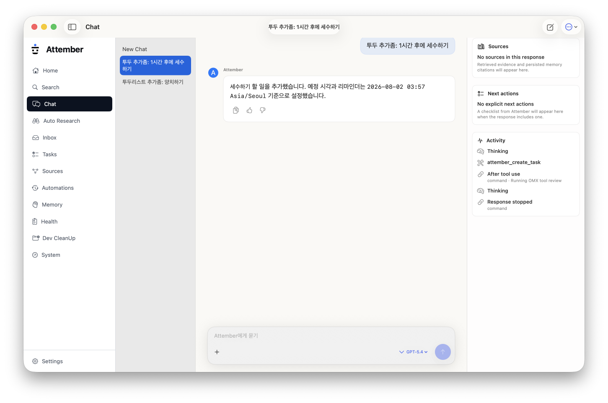 |

| Auto Research | Health |
|---|---|
| 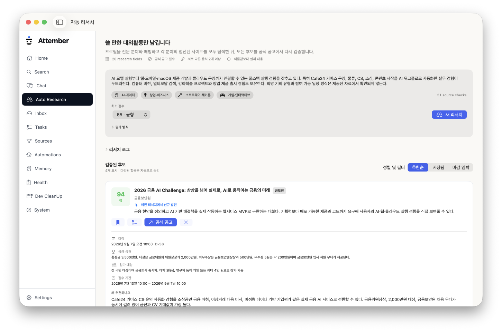 | 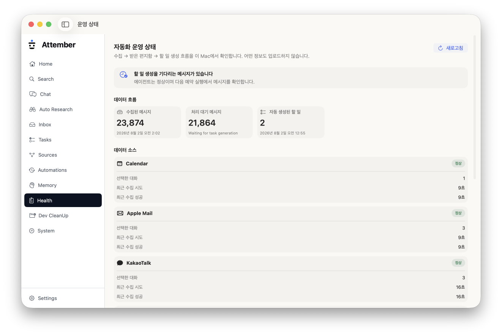 |

| Dev CleanUp | System |
|---|---|
| 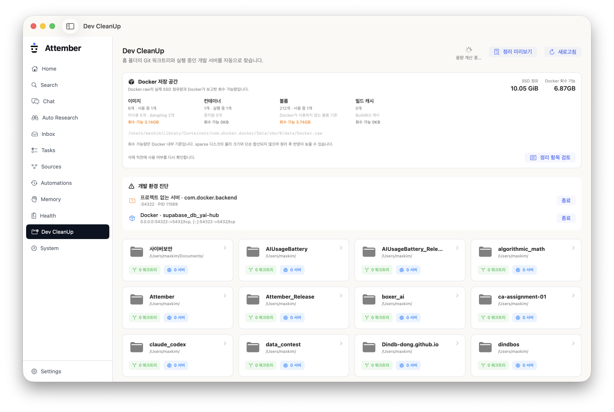 | 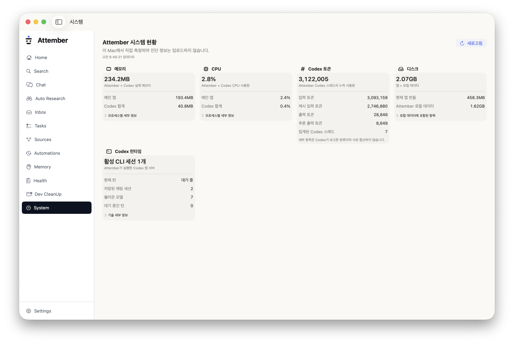 |

### Settings

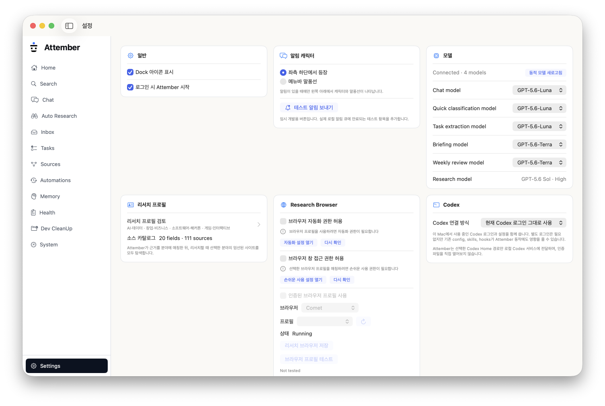

## 동작 구조

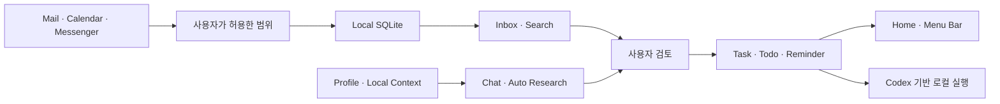

Attember 앱, 백그라운드 Agent와 Codex XPC 서비스가 역할을 나눠 동작합니다. SwiftUI로 만든 네이티브 UI와 GRDB 기반 로컬 저장소를 사용하며, 외부 연결과 AI 기능은 필요한 범위만 선택해서 활성화할 수 있습니다.

## 로컬 우선 원칙

- 기본 데이터는 `~/Library/Application Support/Attember/`에 저장됩니다.
- OAuth 토큰과 커넥터 자격 증명은 macOS Keychain에 보관합니다.
- 사용자가 선택하지 않은 대화와 채널은 수집하지 않습니다.
- macOS Mail·Calendar 계정의 비밀번호를 Attember가 별도로 저장하지 않습니다.
- 백그라운드 작업은 사용자를 대신해 권한 승인을 통과할 수 없습니다.
- 외부 배포나 추가 권한이 필요한 단계는 남은 작업으로 명시합니다.

## 설치

현재 제공되는 빌드는 **Attember 1.0.5 · Apple silicon (arm64)** 용입니다.

1. [Attember 1.0.5 DMG 다운로드](https://github.com/Dindb-dong/Attember_Release/releases/download/v1.0.5/Attember-1.0.5-macOS-arm64.dmg)
2. DMG를 열고 `Attember.app`을 `Applications` 폴더로 이동합니다.
3. Attember를 실행하고 사용할 소스와 권한만 선택합니다.

```text
SHA-256: d046b5e0dc2fa7a6839676e6b65911364186494412bcc404bf3bd3577a1031a6
```

## 기술 스택

- Swift 6 · SwiftUI · AppKit
- GRDB · SQLite
- Codex App Server · Codex SDK · XPC
- EventKit · Apple Mail Automation
- TDLib · Slack Socket Mode · Discord Gateway
- Sparkle · Developer ID · Apple Notarization

## 개발 과정

해커톤 제출물이 만들어진 커밋 흐름입니다. 아래 이미지는 최신 작업부터 초기 구현까지 **1 → 2 → 3 순서**로 이어집니다.

### 1. 통합·안정화와 최종 기능 완성

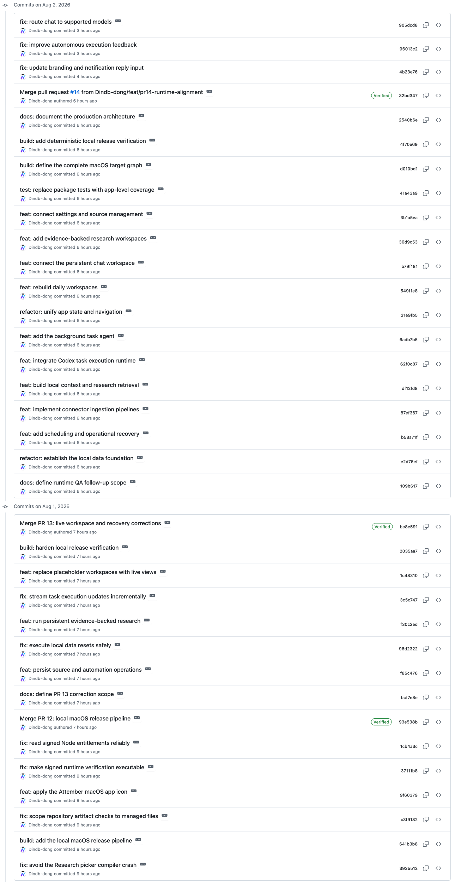

### 2. 핵심 워크스페이스와 에이전트 기능 구현

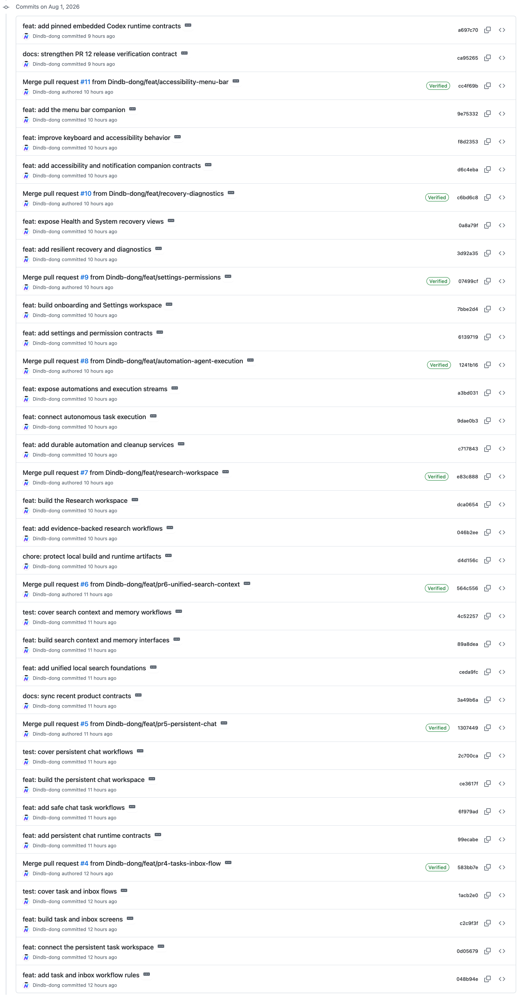

### 3. 제품 기반과 네이티브 앱 구축

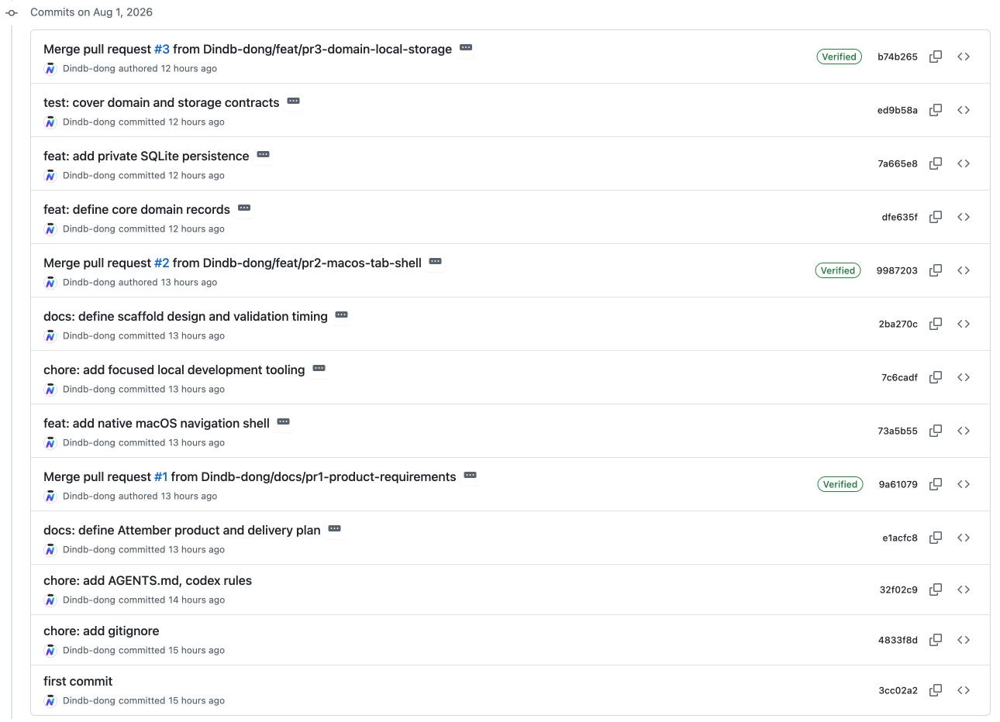

---

Built for **AI Agent:24 Hackathon** by [Dindb-dong](https://github.com/Dindb-dong).
